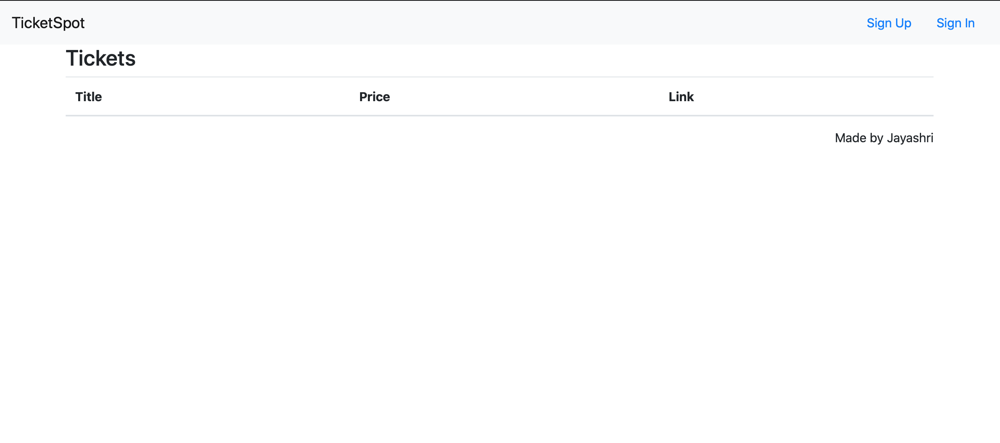
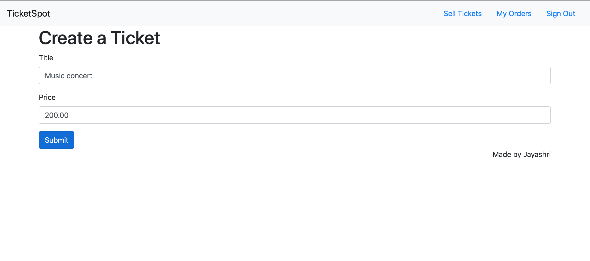
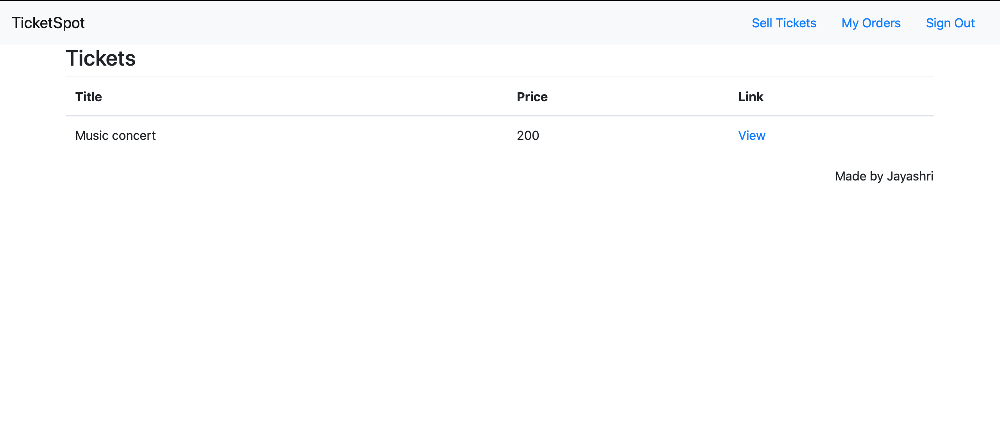
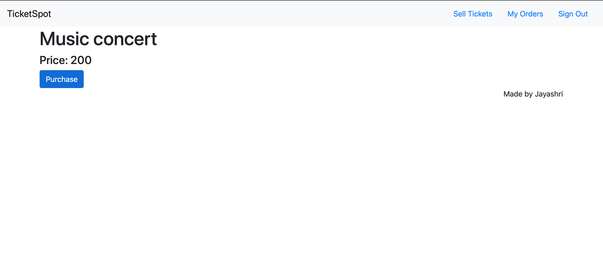

# Ticket Spot - A microservice based application

Live Project link : http://www.myticketspot.live

## Project details :

The basic idea of the project is to develop an ticket sharing app using microservice architecture. 
Anyone can create a new ticket for sale (concert,sport event etc…) in the website and make available for anyone to buy it. 

 ## Technologies used
### Frontend 
-	React and Next JS 
### Backend
-	Node and Express.
-	Typescript

### Databases used 
-	Mongo database and Redis.

### Nats Streaming server
### Payment 
-	Stripe API

### Deployment
-	Entire App is deployed using docker and kubernetes.
-	Digital Ocean is used for production deployment 
-	Google cloud is used for development.

### NPM Library was created and deployed in NPM
-	Name: jaytickets/common

### CI/CI deployment using github

## Highlights and Important features I learned:

-	Microservices & Event based Architecture and niches
-	Cloud Services (GCP)
-	 Reusability of coding
-	Server-Side-Rendereding using React Hooks and Next JS
-	Limit access to your APIs using JWT-based authentication

## App Working in Steps

**Landing page**
- Sign up and sign in

**Create Ticket for sale** 

**Buying tickets**

**Payment method - Stripe & Timer for expiration**

